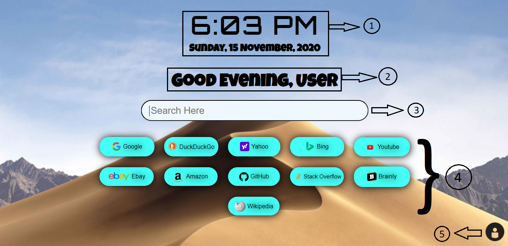

# UniSearchBar

Thanks for visiting the [**Universal Search Bar**](https://dhivijit.github.io/UniSearchBar) ([**UniSearchBar**](https://dhivijit.github.io/UniSearchBar) for short)

This ReadMe file gives the information about the [**UniSearchBar**](https://dhivijit.github.io/UniSearchBar)

The [**UniSearchBar**](https://dhivijit.github.io/UniSearchBar) was created to create simplicity when searching 
for the same term on different search engines or directly searching for answers for your questions on sites like Stack Overflow or searching for products on Amazon

---

# Components of the page



1. Clock
2. Greeting
3. Main Search Bar
4. Options to search your keyword
5. User Settings

---

# Setting Up

## User's Name

#### 1. Click on the User Settings (Number 5).
#### 2. Enter your name in the top field of the settings field of the dialog box.
#### 3.Now Press the Enter Key, Now the setting will be changed and the page will reload to apply the change.

## Country Selection for shopping websites

#### 1. Same as the above step click on the User Settings.
#### 2. Enter the name of your country.
#### 3.Now Press the Enter Key, Now the setting will be changed and the page will reload to apply the change.

```diff
- Note: Some Countries may not be supported(It will show you a dialog box to notify you), To add them make a issue in the repository.
```

## Time Format

#### 1. Click on the User Settings.
#### 2. Select your choice of Time Format (Whether you want it in 12 hour format or 24 hour format and also a option to show the seconds in the time or not).
#### 3. Clicking the option will automatically Apply the changes and reload the page.

## Default Search Engine

#### 1. Click on the User Settings.
#### 2. Click on your preferred Search Engine.
#### 3. Clicking the option will automatically Apply the changes and reload the page.

---

## Tip: After typing your keyword you can press the enter key to make the search in your default search engine

## Available Search Engines 

 - Google
 - DuckDuckGo
 - Yahoo
 - Bing

---

## Countries Supported for the shopping websites:

 - Australia
 - Brazil
 - Canada
 - China
 - France
 - Germany
 - India
 - Italy
 - Japan
 - Mexico
 - Netherlands
 - Spain
 - United Kingdom (Typing "uk" or "unitedkingdom" will Enable it)
 - United States of America (Typing "us" or "unitedstates" will Enable it) 

  - #### (Will add more countries to the list soon)
